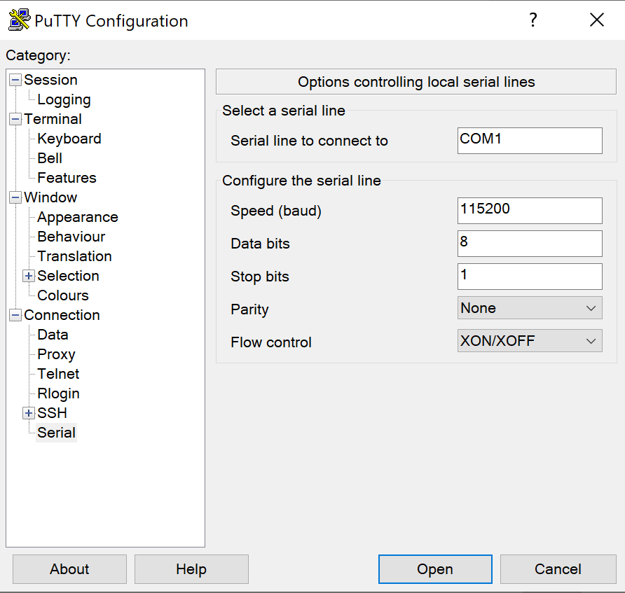

# MicroPython Serial configuration

## PORT CONFIGURATION
There must be a port open with the speed 115200 open for the ESP32 and Python library to connect. This can be done using the PuTTY app which is available on Windows and Linux. This must be ran while the board is not attached.

The board cannot be connected to any Micro-Python specific IDE through serial, otherwise it will be undetectable by the Python library.

## Using the library

The library itself has an initialiser for board. The initialiser takes no parameters.

`B=Board()`

The board object will not be connected to a device. If you do not know what COM your device is on, then you can use the serial ports method. This returns an array of all available ports.

`print(B.serial_ports())`

One you know which COM is the board you want the library can connect as follows:

`B.connect('COM9')`

The COM can be added as a string parameter.

This gives the option to list the ports that are default and should be ignored. If you know exactly what port to connect to then use the lookFor parameter as a string with your wanted port. For example:

`B=Board(lookFor=’COM9’)`
